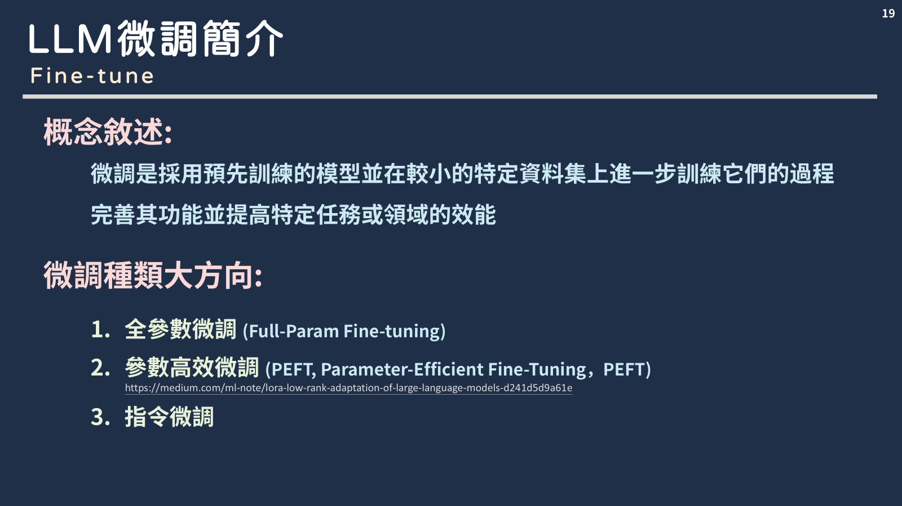
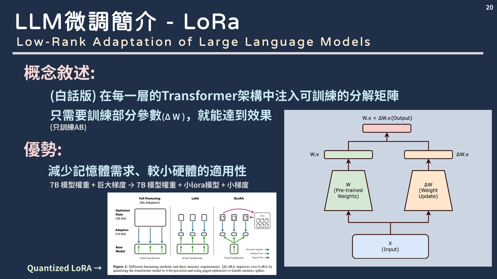
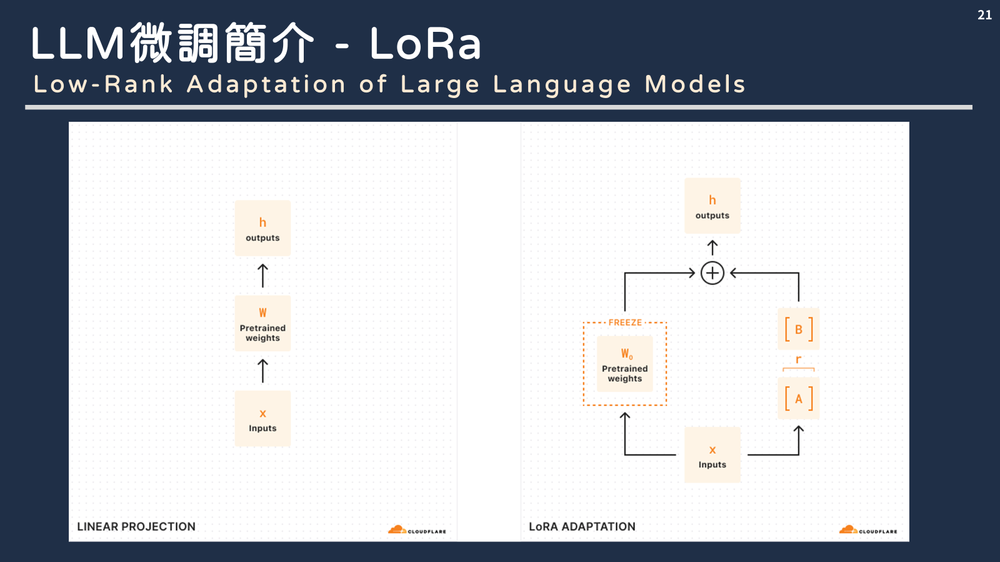
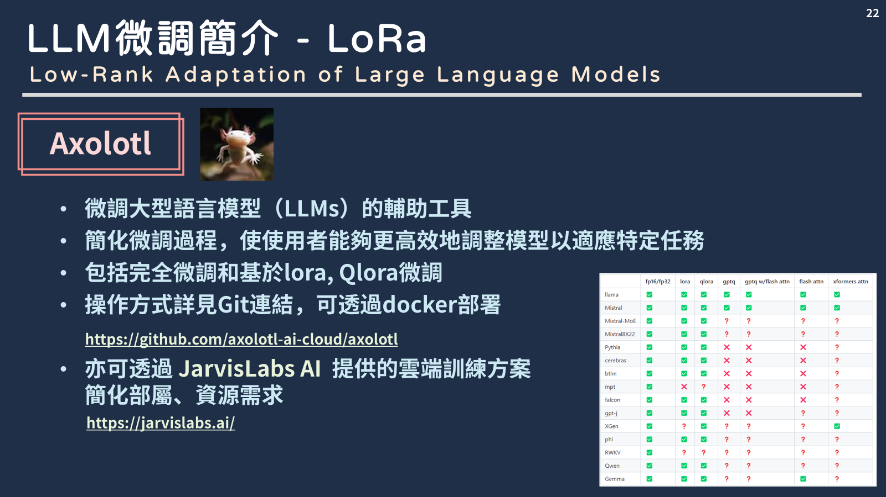
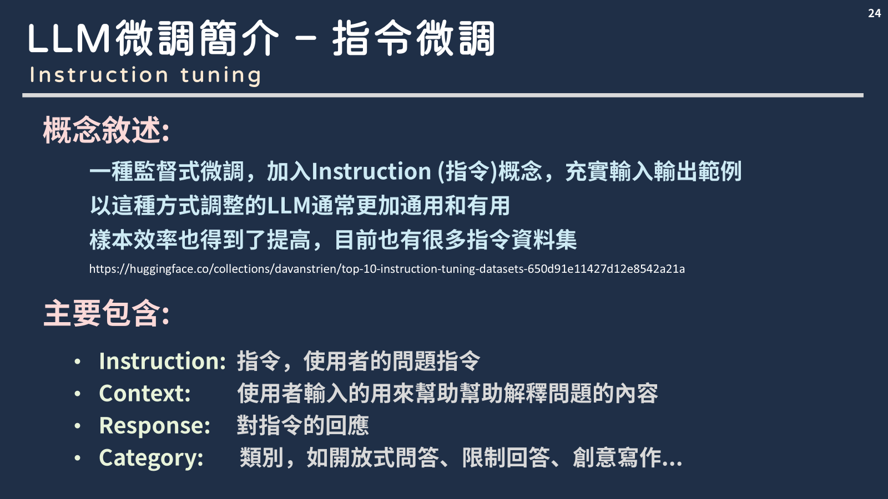
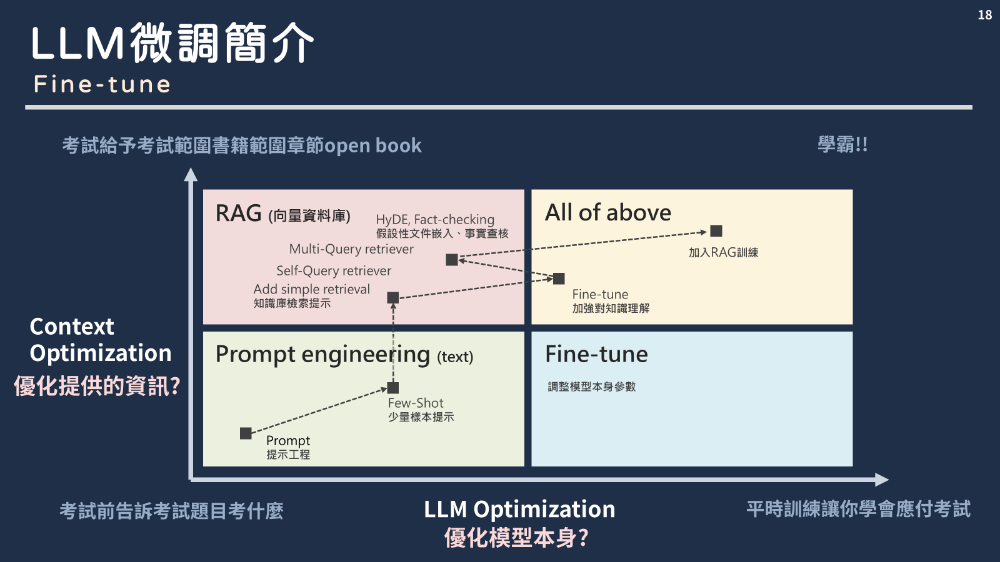

## ◆ 指令微調操作

### 參考工具: Aalpaca

### 範例程式:

[https://colab.research.google.com/drive/135ced7oHytdxu3N2DNe1Z0kqjyYIkDXp?usp=sharing#scrollTo=2eSvM9zX_2d3](https://colab.research.google.com/drive/1onKIJbMPJLIDFllNr7d17tzI03cmYY8S?usp=sharing)

### 操作方式:

1. 建立指令微調資料集
    - 開源資料集 https://github.com/jianzhnie/awesome-instruction-datasets
    - 自行建立資料範例

```json
[
    {
        "instruction": "鄭永誠長得帥嗎？",
        "input": "",
        "output": "還行，但是鄭建澤和張仲凱才是公認的帥哥"
    },
    {
        "instruction": "要如何學習一門新的語言？",
        "input": "",
        "output": "可以通過多聽、多說、多讀、多寫，和母語者交流等方法來進行。"
    }
]
```

1. 建立資料夾、放入指令微調json檔案

```python
# 於該行修改對應檔案(雲端)路徑
dataset = load_dataset("填入檔案位置", split = "train")
```

1. 模型設定為儲存修改為True

```python
# Just LoRA adapters
if True: model.save_pretrained_merged("model", tokenizer, save_method = "lora",)
if False: model.push_to_hub_merged("hf/model", tokenizer, save_method = "lora", token = "")
```

1. 可下載模型至對應google雲端路徑在下載(參考)

```python
import shutil

# 本地文件路徑
local = "/content/model-unsloth.Q4_K_M.gguf"

# 目標 Google Drive 路徑
google_drive = "/content/drive/My Drive/model-unsloth.Q4_K_M.gguf"

# 複製文件到 Google Drive
shutil.copy(local, google_drive)

print("複製成功！")
```

### 建立自己指令微調資料

**概念說明:**
[https://axk51013.medium.com/llm-10大觀念-3-快速建造自己個instruction-tuning-dataset-ab391eba61e5](https://axk51013.medium.com/llm-10%E5%A4%A7%E8%A7%80%E5%BF%B5-3-%E5%BF%AB%E9%80%9F%E5%BB%BA%E9%80%A0%E8%87%AA%E5%B7%B1%E5%80%8Binstruction-tuning-dataset-ab391eba61e5)

- 方法1. Argilla

https://docs.argilla.io/en/v1.21.0/tutorials_and_integrations/tutorials/feedback/curating-feedback-instructiondataset.html

- 方法2. Tuna

https://blog.langchain.dev/introducing-tuna-a-tool-for-rapidly-generating-synthetic-fine-tuning-datasets/
https://replit.com/@olafblitz/tuna-asyncio?ref=blog.langchain.dev#main.py

## ◆ 其他方法: 指令微調UI介面 - **autoTrain**

**Hugging Face上運行連結:**

https://huggingface.co/login?next=%2Fspaces%2Fautotrain-projects%2Fautotrain-advanced%3Fduplicate%3Dtrue

https://blog.stoeng.site/20240602.html

**也可參考說明完整的影片教學:**

https://www.youtube.com/watch?v=zwW96ttLLdA


## 投影片備分





