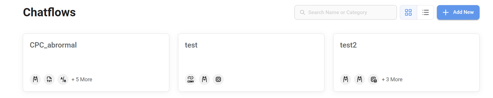

# Flowise簡單操作 (LLM UI Tool)

Owner: 鄭永誠
Tags: LLM
Type: LLM

# 簡介

[**https://docs.flowiseai.com/**](https://docs.flowiseai.com/)

Flowise 是一個開源程式工具，
可以透過極清楚簡單的UI介面，實踐 LLM 流程規劃、完成Low code AI agent
能夠幫助新手(如我)加速LLM架構設計、模型串聯、超參數測試的流程!!!!
也跟LangChain, LlamaIndex有很好的整合!!!


補充: 當然你也能直接用 Langflow(也很好用)，但我覺得Flowise比較好上手理解


詳細可以參考Langflow介紹或網站連結 
[LangFlow簡單操作(LLM UI tool)](https://www.notion.so/LangFlow-LLM-UI-tool-9877eab3063c41c5a0955202c6078c1a?pvs=21)


**可以看到，Flowise 將各流程都用UI介面輔助串接，是不是很簡單明瞭~   

**可以說是我這種程式笨蛋的福音!!**

**像是上圖，就串聯到了LLM流程中幾個基本工具(括號為使用的類型)**

- 文本分割器 (LangChain的Recursively split by character)
- txt loader
- 向量資料庫 (免費使用的Pinecone)
- Embedding model (llama3)
- LLM (llama3)
- RetrievalQA chain (LangChain框架下整合套件)

### **整體而言，我整理Flowise有以下幾個小優點~**

- **能快速測試不同模組**
    
    若想換個語言模型、換個向量資料庫，隨時可拉新的物件進來
    
    然後重新連一連就完成了!!!
    
- **較快掌握模組間串聯關係**
    
    根據UI顯示的節點，你能快速掌握各模組的輸入、輸出是什麼
    
    快速套用LangChain, LlamaIndex開發框架
    (前者較為通用、後者重視數據層的data augmentation generation)
    
- **超參數測試調整**
    
    快速了解各模組的超參數有哪些，(要按Additional Parameters展開)
    
    透過介面快速去設定調整這些超參數、加上prompt或相關設定等
    

- **API切換**
    
    簡單切換不同API key，
    若有多個API key，讓你平常測試時要換不同credentail不用在程式碼調來調去，
    直接介面操作換一個就可以了(這邊是換向量資料庫的API key)，並能輔助管理
    
    


- **快速掌握有哪些工具可以使用**
    
    我覺得這個還蠻重要的~
    
    可以掌握有哪些工具/模塊是能使用的(常見的幾乎都有，也都有在定期更新)
    
    就像不同形狀的樂高，讓你簡單拼湊(左上角展開) (Langchain架構模塊相對完整)
    
    %203b4bd1c0d0a54a61ae2d65c46e7f1797/Untitled%204.png)
    

- **即時測試互動**
- **有市場範例和導入模板!!!**
    
    能直接在Marketplaces頁簽，參考別人使用的LLM框架模板!!!
    


- **管理建立的chatflow**
    
    
    
- **支持用戶密碼登錄形式**
啟動時設置
`npx flowise start --FLOWISE_USERNAME=user --FLOWISE_PASSWORD=1234`
- **完成後，建立API**(其實就完成一個產品/服務了)


# 開始吧

### **1. 下載Flowise**

[https://github.com/FlowiseAI/Flowise](https://github.com/FlowiseAI/Flowise)

可參考連結quick start流程(看個人)

- Install Flowise
    
    ```
    npm install -g flowise
    ```
    
- Start Flowise
    
    ```
    npx flowise start
    ```
    

伺服器預設位置

[http://localhost:3000/](http://localhost:11434/)

### **2. 把其他對應需求下載、申請完畢(看個人)**

- **下載Ollama (開源又好用的LLM，免費賽高)**
    
    開源好用的LLM模型，誰能拒絕一個可愛又免費的草泥馬呢?
    
    [https://ollama.com/downloa](https://ollama.com/download)
    
    ```powershell
    # 終端機執行
    ollama run llama3
    ```
    
    執行後伺服器預設位置
    
    [http://localhost:11434/](http://localhost:11434/)
    

- **申請Pinecone，並建立API KEYS**
    
    [https://www.pinecone.io/](https://www.pinecone.io/)
    
    可以申請一個免費的線上的向量資料庫，也能做對應的管理(重點還是免費)
    


- **還有好多，想玩自己載**

### **3. 簡單操作**

- **自己摸，可以先按照我下面拉最簡單範例**


      語言模型+對話+記憶方式

按右邊紫色，就能測試對話了

- **加上資訊(RAG) LLM範例**


      多串了Document Loaders(for txt)、文檔拆分器、向量資料庫、…

      也可以自行換成其他模組並做參數調整

# 工具種類說明 (後面課程會說明更細節)

- Agent——將大語言模型的決策與工具結合起來，使其能夠實施和執行行動
- Chains——允許組合人工智能應用程序的不同組件，如prompts，大語言模型和儲存器
- Loaders——允許與外部源集成以上傳信息，如PDF、CSV等
- Embeddings——將文本嵌入到向量潛在空間的模型
- LLMs——用於理解和生成文本的模型，如OpenAI模型
- Memories——LangChain組件，能夠維護會話的記憶
- Prompts——用於定義prompts框架的模板
- Retrievers——用於信息檢索的組件，通過倒排索引從大規模文本數據集中檢索相關信息，以支持多輪對話系統的問答
- Text Splitters——將文本分割成更小的塊並避免tokens限制問題的實用程序
- Toolkits——為特定用例與外部系統集成，例如，CSV文件或Python Agent
- Tools——代理可以用來與外部工具交互的功能，如必應搜索或本地文件系統
- Utilities——對Google API或Bing API等系統有用的包裝器
- Vector Stores——向量數據庫，文本Embeddings可以保存，然後與用戶的輸入進行匹配
- Wrappers——請求庫的輕量級包裝器