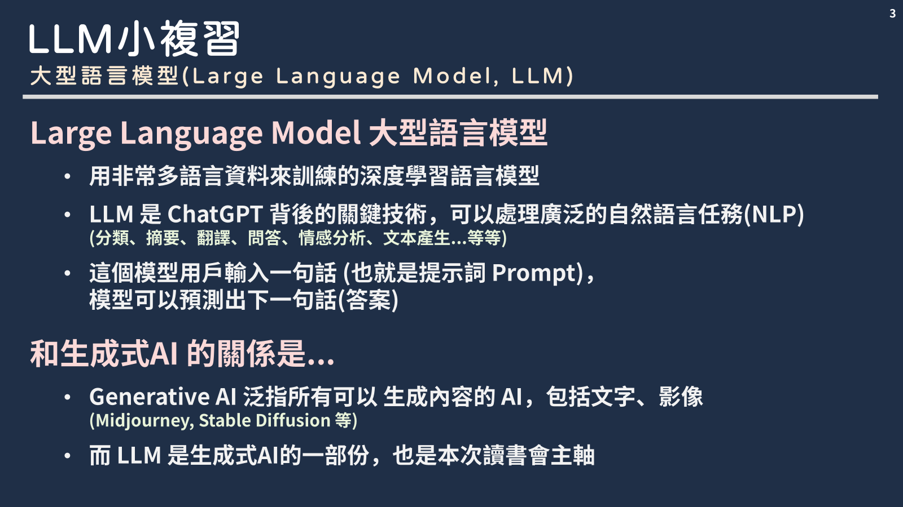

  <h1>🤖 大型語言模型入門教學 中文分享整理  💻</h1>
  

    ✍️ <a href="https://hackmd.io/@pputzh5cRhi6gZI0csfiyA/H1ejIyxHR"> 作者: 鄭永誠</a> • 
    ✉️ <a href="mailto:jason0304050607@gmail.com">信箱</a> • 
    🧑‍🤝‍🧑 <a href="https://www.dalabx.com.tw//"> 合作夥伴: 紫式大數據決策 </a> • 
    👫 <a href="https://moraleai.com/"> 我的朋朋: Morale AI </a> 
  

 

內容簡介:
1. 🍻 **LLM基礎改念:** 我會整理一些LLM的需求知識，但git上是實作資源為主不會講述太多，有興趣請密我
2. 🛠️ **LLM相關工具:** 以下內容全基於python實踐，同時會分享相關資源、套件、開源API...
3. 💬 **LLM系統架構:** 會帶你由淺入深，慢慢了解部屬LLM系統(多Agent)的方向和一些好用工具

這個分享內容宗旨:
1. 🧩 **讓你好上手:** 提供最簡單的、盡可能可複製即用的code，讓新手也能盡可能快速入門 (而且是中文XD)
2. 🎈 **讓你免費玩:** 全基於開源資源，讓你能夠無痛體驗LLM的功能和操作
3. 😊 **讓你喜歡上:** 盡量提供簡單有趣的小例子，附上完整註解說明，讓你也能喜歡LLM可帶來的運用

範例使用版本/輔助工具:
- Python 3.12.4
- 語言模型主要使用 llama-3.1-70b-versatile
- 個人主要使用 IDE: VScode
- 搭配工具 寫程式大幫手 [Copilot](https://github.com/features/copilot)
- 其他: 使用 [pylint](https://code.visualstudio.com/docs/python/linting) 擴充套件來管理 Python 程式碼的風格

主要資料來源:
  💻 <a href="https://github.com/">資料來源1: 偉大的Github</a> 
  🤗 <a href="https://huggingface.co/">資料來源2: 偉大的抱抱臉</a> 
  👨 <a href="https://github.com/underlines/awesome-ml/blob/master/llm-tools.md/">巨人的肩膀: LLM相關工具大整理</a>

---------------
  

## 課程內容

(因分享會有搭配我的簡報才會以這個架構講述，實際上這些課程無直接連貫性!!!)

### ✔️ Part 0: LLM 導論 (Instruction)
(這些皆以前讀書會簡報內容，恕此處跳過)
💡本章節讓你從0開始，讓你了解AI到底是啥、LLM基礎原理到底是怎麼運作的，
以及了解踏入LLM這塊領域時你必須了解的相關的名詞和知識

| 主題 | 簡介 | 類別 | Notebook | Resource|
|----------|-------------|:----------:|:----------:|:----------:|
| I1-人工智慧簡介與發展近況 | 什麼是AI? 發展學派與歷史脈絡| 基礎課程 | 見讀書會ppt||
| I2-機器學習基本概念 |機器/深度學習最最最白話版基礎概念| 基礎課程 | 見讀書會ppt||
| I3-LLM基礎原理 |Token, Embedding, Transformer...等基礎| 基礎課程 | 見讀書會ppt||
| I4-LLM相關知識|提示工程、RAG與LLM框架、Fine-tuned，模型超參數| 基礎課程| 見讀書會ppt||
| I5-實踐工具|LangFlow / Flowise 快速實踐工作流程| 延伸補充 | [flowise](Flowise.md)|[langflow](https://www.langflow.org/)|
| I6-簡易部屬|內部使用OpenWeb UI / Anything LLM部屬| 延伸補充 | 見讀書會ppt|[OpenWebUI](https://github.com/open-webui/open-webui)|

### ✔️ Part 1: Python 基礎實踐與建立流程

💡本章節你將了解LLM的基礎使用和部署概念，
從如何使用LLM、如何建立簡單介面展示、建立流程並管控這些流程等
並補充一些RAG和fine-tuned的先備知識

| 主題 | 簡介 | 類別 | Notebook |
|----------|-------------|:----------:|:----------:|
| C0-前置作業與基礎工具|建立虛擬環境、基礎python輔助工具| 前置準備 |[C0](C0-Basic_info.ipynb)|
| C1-簡單使用範例|Groq操作、程式實踐基礎問答| 基礎課程 |[C1](C1-Get_start_with_groq.ipynb)|
| C2-立刻部屬簡易系統|Gradio快速實踐系統介面、即時對話系統| 基礎課程 |[C2](C2-Create_llm_ui.ipynb) |
| C3-已結合LLM的一些開源工具|一些AI工具如open-interpreter,Scrapegraph-ai...| 額外分享 |[C3](C3-Ai_tools.ipynb)|
| C4-進階RAG操作|Reranker概念和效果| 延伸補充 |[C4](C4-Advanced_rag.ipynb)|
| C5-實踐LLM服務Agent流程-1|基於Langchain架構下的LangGraph實踐| 進階課程 |[C5](C5-Agent_flow.ipynb)|
| C6-實踐LLM服務Agent流程-2|基於Langchain架構下的LangGraph實踐| 進階課程 |[C6](C6-Agent_flow.ipynb)|
| C7-將Agent流程進行管控|使用langsmith來管理、更清楚瞭解建立的流程| 進階課程 |[C7](C7-Llm_application.ipynb)|
| C8-fine-tuned簡易操作範例|使用Unsloth簡易實踐qLora fine tuned(只放程式碼、不實際運行)| 進階課程 |[C8](C8-Finetune.md)|

### ✔️ Part 2: Routing in RAG-Driven Applications

💡 本章節你將學會更進一步的資料處理流程，
最終完整流程(Data Ingestion)可能包含:

- **Loaders** ➡️ 允許與外部源集成以上傳信息

- **transormers** ➡️ 各種資料處理流程，如 parse (轉換), split to chunk(分割), extract(擷取), embedding(向量化)... 等多種流程

- **Vector Stores** ➡️ 將資訊存入向量資料庫

- **Retrievers** ➡️ 建立用於信息檢索的組件，從大規模文本數據集中檢索相關信息，即實踐RAG

- **LLM Agent / Tools** ➡️ 各個處理問題的Agent、LLM模型或各種工具

- **Memories** ➡️  可能會有記錄對話的需求，特別當你建立的是對話式的LLM應用時

- **Output Parsers** ➡️ 把結果轉換成需求的格式，常見如json, md...

| 主題 | 簡介 | 類別 | Note|
|----------|-------------|:----------:|:----------:|
| C9-文本資料處理基礎|文檔spit, parse, extract等概念和建立pipeline| 基礎課程 |[C9](C9-Doc_manage.ipynb)|
| C10-文本處理流程概念|接續C9，資料處理、Ingestion Pipeline與RAG routing| 基礎課程 ||
| C11-向量資料庫建置與各功能|| 基礎課程 ||
| C12-其他資料庫結構|知識圖譜與GraphRAG| 延伸補充 ||

## 先備知識
### 1. LLM是什麼 ?
- 大型語言模型 (Large Language Model) 的簡稱
- 你可以把他理解成是一個模型，能根據輸入的文字生成文字回傳，就像在做文字接龍一樣
- 背後深度學習, Tokenization, embedding, attention機制, Transformer 等相關介紹詳見以前分享

### 2. Hugging Face 🤗 是什麼?
- 你可以把他理解成AI界的Github
- 使用者可以在上邊發表和[共享預訓練模型](https://huggingface.co/docs/transformers/model_sharing)、資料集和展示檔案
- 許多[模型排名](https://huggingface.co/spaces/open-llm-leaderboard/open_llm_leaderboard)、[程式範例](https://huggingface.co/docs/transformers/llm_tutorial)都可在上面找到

### 3. Llama 🦙 是什麼 ?
- Llama是Meta開發的一系列大型語言模型，如llama2, llama3, llama3.1
- 這些語言模型都是免費的!!也能自行去做模型參數微調訓練(Fine-tuned)
- 至於其他常見付費LLM則包含[Open AI](https://openai.com/index/openai-api/), [Claude](https://www.anthropic.com/api)系列...

### 4. Ollama 是什麼 ?
- 開源的本地端LLM平台
- 允許用戶在自己的電腦上運行和調用多種開放原始碼的語言模型
- 若要部屬自己公司/組織內部的LLM，可以運用其資源
- 建議可搭配[Open WebUI](https://docs.openwebui.com/)、[AnythingLLM](https://anythingllm.com/)實踐UI操作介面和管理

### 5. LangChain 是什麼 ?
- [LangChain](https://python.langchain.com/v0.2/docs/introduction/)是LLM框架，目的在簡化使用大型語言模型（LLMs）開發應用程序的過程
- 你可以簡單理解成他是個工具箱，把LLM操作過程可能需要的工具、外部數據源整合起來
- 有這個工具箱，你就能更方便的調用他撰寫python llm相關程式
- 其他優勢包含很多延伸服務和工具也基於他被開發出來 (如後面會講到的[LangGraph](https://langchain-ai.github.io/langgraph/))
- 對於新手而言，他官網上也有非常大量[範例程式](https://python.langchain.com/v0.2/docs/tutorials/llm_chain/)輔助你實踐llm
- 其他常用框架還有LlamaIndex，其更擅長處理文本(e.g.非結構資訊)、自定義知識庫、有多種索引查詢功能

### 6. 機器學習 (Machine Learning)、深度學習 (Deep Learning )、人工智慧 (Artificial Intelligence) 之間的關聯是?
- AI (人工智慧) 泛指使電腦和機器能夠模擬人類智慧和解決問題能力的技術，做到各種人類的判斷或行為
- ML (機器學習)，則是一種常見的技術手法，你可以想像成找出一個  𝑓(𝑥)，可以根據輸入值生成想要的結果  
- 至於 DL (深度學習)，則是ML領域中基於神經網路(NN)的概念，一種表現亮眼的技術類型
- GAI (生成式人工智慧) 則是當中一種可以創造新內容和想法的AI概念，如創造對話、故事、影像、視訊和音樂!
- 當今(2024.6)，GAI領域、如本讀書的重點LLM，當中最主要仰賴的技術模型就是DL為主!!!
- 見下圖，你就能很清楚知道他們之間的關係!!!!!

### 7. Transformer 是什麼 ?
- Transformer是一種深度學習模型架構，在多種自然語言(NLP)任務處理表現出色
- 為當今(2024)生成式AI的浪潮重大突破的核心技術概念

- ChatGPT 裡面的 "T"，指的就是Transformer喔!

### 8. 我該使用什麼模型?
- 模型更新很快，且不同模型在不同面相有不同表現，我這邊不會特別推薦一定要用哪個!
- 模型普遍理論上，參數越多效果越好，但所需資源空間也越大，如Llama 3.1 405B就代表他是405billion參數的大模型
- 建議去看HuggingFace上的[LeaderBoard](https://huggingface.co/spaces/open-llm-leaderboard/open_llm_leaderboard)，看看個模型在不同面向、語系的排名
- 若是要用開源模型，建議可先去[Together.ai](https://api.together.ai/signin?redirectUrl=/playground/chat/meta-llama)之類的免費測試不同模型效果~ 再決定用哪個
- 這邊範例，都會是以免費、開源的模型為主!! 甚至是用一些直接免下載模型的API~

## 主要使用的課程套件/工具/架構運用摘要
- C0: 可略過
- C1: Langchain, Groq, llama_index
- C2: Gradio
- C3: 可略過
- C4: Sentence-transformer, Reranker (with Jina)
- C5: Langchain, LangGraph
- C6: Langchain, LangGraph
- C7: LangSmith
- C8: Unsloth
- C9: llama_index

接下來就請去各ipynb筆記上去了解如何操作吧 ~

## 補充: 愛用工具/連結推廣
1. [Langflow](https://www.langflow.org/) / [Flowise](https://github.com/FlowiseAI/Flowise): 帶你實踐no code介面串接開發大型語言模型應用程式

2. [COZE](https://www.coze.com/home) (以前免費常用...但現在QQ): 快速部屬LLM服務、Agent、建立dicord bot、設計workflow等，介面很舒服

3. [perplexity](https://www.perplexity.ai/): 目前(2024.7)用起來最順的LLM輔助網頁搜尋工具

4. [claude 3.5 sonnet](https://claude.ai/new): 目前(2024.7)覺得code表現能力最棒的LLM，特別是他的[Artifacts](https://www.youtube.com/watch?v=rHqk0ZGb6qo)功能

5. 寫程式一定要[Copilot Github](https://github.com/features/copilot) 或是嘗試近期(2024.7)熱門的 [Cursor](https://www.cursor.com/)，後者我雖沒在用，但都很推

## 自學連結
1. Hugging Face, Github；甚至是 [GAI年會](https://discord.gg/g662TXV6)、臉書社團, iT 邦幫忙, Medium 文章等資源

2. [LLM roadmap學習方向 – 技術面 & 應用面 (github)](https://github.com/mlabonne/llm-course)

3. 李宏毅 – 生成式導論2024 [(YT)](https://www.youtube.com/watch?v=AVIKFXLCPY8&list=PLJV_el3uVTsPz6CTopeRp2L2t4aL_KgiI)

4. 李宏毅 – 【機器學習 2023】(生成式 AI) [(YT)](https://www.youtube.com/watch?v=yiY4nPOzJEg&list=PLJV_el3uVTsOePyfmkfivYZ7Rqr2nMk3W)

5. 李宏毅 – 【機器學習 2022 】[(YT)](https://www.youtube.com/watch?v=7XZR0-4uS5s&list=PLJV_el3uVTsPM2mM-OQzJXziCGJa8nJL8)

6. 陳縕儂 – 深度學習應用、人工智慧導論 [(YT)](https://www.youtube.com/watch?v=g4yONRTpbE4&list=PLOAQYZPRn2V658cD6AjiBmKohfMIevWO7)

7. [LLM相關論文整理日更 (github)](https://github.com/xianshang33/llm-paper-daily)

8. 諸多YT上資源
    - 01Coder
    - 零度解說
    - 最佳拍檔
    - 王木头学科学
    - Ph.D. Vlog
    - AI Jason
    - AI超元域
    - 跟李沐学AI (Mu Li)
    - GrandmaCan -我阿嬤都會
    - 3Blue1Brown
    - AI小码哥

9. LLM資源彙總 [(github)](https://github.com/liguodongiot/llm-resource)

10. [llama中文社區 ](https://github.com/LlamaFamily/Llama-Chinese)

## Backup URL
- [NVIDIA NeMo](https://www.run.ai/guides/ai-open-source-projects/nvidia-nemo)、[NeMo GitHub](https://github.com/NVIDIA/NeMo)
- [NV llama-3_1-405b-instruct](https://build.nvidia.com/meta/llama-3_1-405b-instruct)
- https://github.com/xubuvd/LLMs
- [vanna](https://github.com/vanna-ai/vanna)、[Ragas](https://github.com/explodinggradients/ragas)、[RagGraph](https://github.com/microsoft/graphrag)
- [zapier](https://zapier.com/app/home)  完全沒任何基礎也能建置如信件、notion等的流程整合服務工具
- [Dify](https://cloud.dify.ai/apps) 目前用起來覺得，UI介面最舒服且最無難度的上手no code應用流程建置工具 (但要錢用的模型也要錢)

## 問題回饋 🤔

如有問題，歡迎用各種方法直接聯繫我，或在GitHub Issue中提交喔~  

  &nbsp;&nbsp;&nbsp;&nbsp;
  &nbsp;&nbsp;&nbsp;&nbsp;
  &nbsp;&nbsp;&nbsp;&nbsp;
  &nbsp;&nbsp;&nbsp;&nbsp;
  

  版權所有© 2024 鄭永誠 YC-Cheng (Jason)。保留所有權力。

