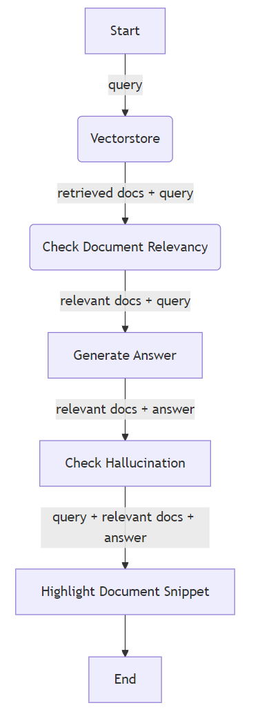
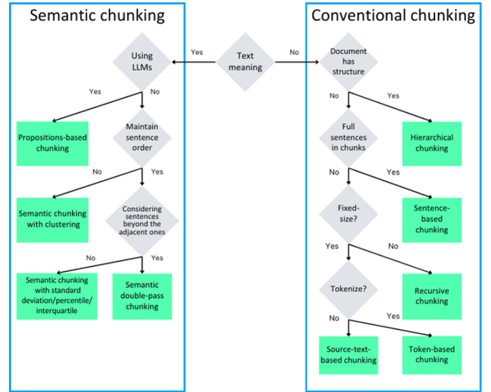
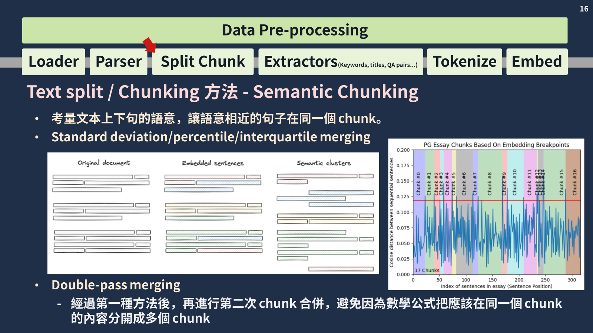
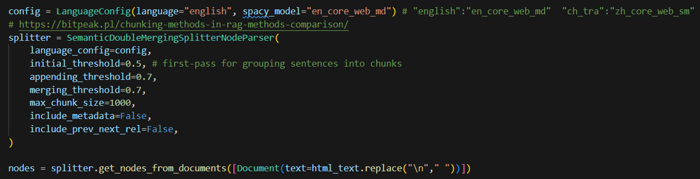
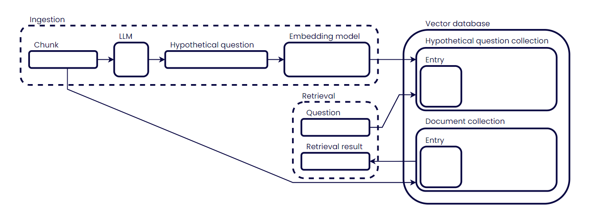
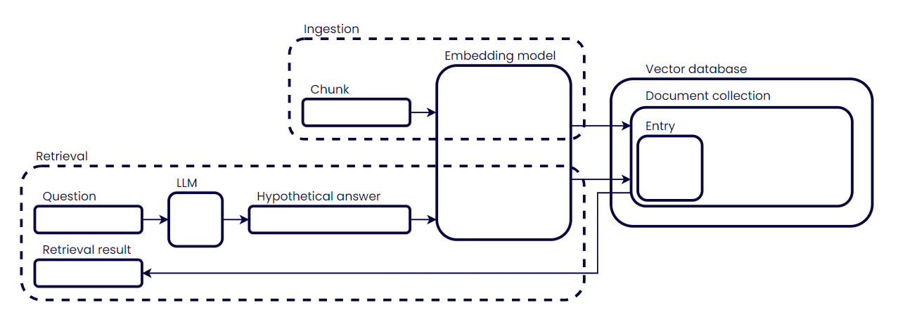
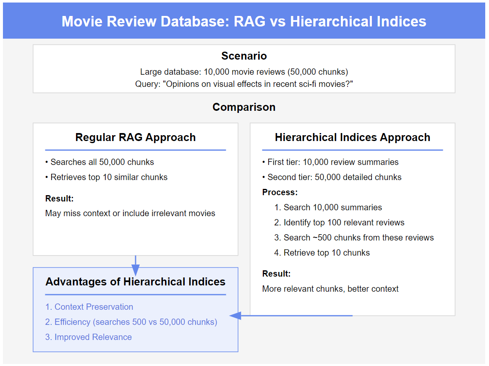

## Introduction

Retrieval-Augmented Generation (RAG) 的各種方式、策略介紹


## Advanced Techniques

Explore the extensive list of cutting-edge RAG techniques:

### 🌱 Foundational RAG Techniques

1. Simple RAG 🌱
   - **[LangChain](https://github.com/NirDiamant/RAG_Techniques/blob/main/all_rag_techniques/simple_rag.ipynb)**
   - **[LlamaIndex](https://github.com/NirDiamant/RAG_Techniques/blob/main/all_rag_techniques/simple_rag_with_llamaindex.ipynb)**

   #### Overview 🔎
   Introducing basic RAG techniques ideal for newcomers.

   #### Implementation 🛠️
   Start with basic retrieval queries and integrate incremental learning mechanisms.


2. **[Reliable RAG 🏷️](https://github.com/NirDiamant/RAG_Techniques/blob/main/all_rag_techniques/reliable_rag.ipynb)**

   #### Overview 🔎
   Enhances the Simple RAG by adding validation and refinement to ensure the accuracy and relevance of retrieved information.
   Hallucination Check：在最終確定答案之前，系統會透過驗證檢索到的文件是否完全支援產生的內容來檢查幻覺。

   #### Implementation 🛠️
   Check for retrieved document relevancy and highlight the segment of docs used for answering.  




3. **[Proposition Chunking ⛓️‍💥](https://github.com/NirDiamant/RAG_Techniques/blob/main/all_rag_techniques/proposition_chunking.ipynb)**

   #### Overview 🔎
   Breaking down the text into concise, complete, meaningful sentences allowing for better control and handling of specific queries (especially extracting knowledge).

   #### Implementation 🛠️
   - 💪 **Proposition Generation:** The LLM is used in conjunction with a custom prompt to generate factual statements from the document chunks.
   - ✅ **Quality Checking:** The generated propositions are passed through a grading system that evaluates accuracy, clarity, completeness, and conciseness.

4. **Semantic Chunking**



#### Additional Resources 📚
   - **[The Propositions Method: Enhancing Information Retrieval for AI Systems](https://medium.com/@nirdiamant21/the-propositions-method-enhancing-information-retrieval-for-ai-systems-c5ed6e5a4d2e)** - A comprehensive blog post exploring the benefits and implementation of proposition chunking in RAG systems.

### 🔍 Query Enhancement

1. **Query Transformations (Rewriter)** 🔄  
   - **[LangChain](all_rag_techniques/query_transformations.ipynb)**  
   - **[Runnable Script](all_rag_techniques_runnable_scripts/query_transformations.py)**

   #### Overview 🔎
   Modifying and expanding queries to improve retrieval effectiveness.
   ```
   Original query: 氣候變遷對環境有哪些影響？
    1. 氣候變遷如何影響生物多樣性和生態系？
    2. 氣候變遷對海洋條件和海洋生物有哪些影響？
    3. 氣候變遷如何影響天氣模式和極端天氣事件？
    4. 氣候變遷對森林和沙漠等陸地環境有何影響？
    ```

   #### Implementation 🛠️
   - ✍️ **Query Rewriting:** Reformulate queries to improve retrieval.
   - 🔙 **Step-back Prompting:** Generate broader queries for better context retrieval.
   - 🧩 **Sub-query Decomposition:** Break complex queries into simpler sub-queries.

2. **Hypothetical Questions (HyDE Approach)** ❓  
   - **[LangChain](all_rag_techniques/HyDe_Hypothetical_Document_Embedding.ipynb)**  
   - **[Runnable Script](all_rag_techniques_runnable_scripts/HyDe_Hypothetical_Document_Embedding.py)**

   #### Overview 🔎
   Generating hypothetical questions to improve alignment between queries and data.

   #### Implementation 🛠️
   Create hypothetical questions that point to relevant locations in the data, enhancing query-data matching.

    假設問題生成方法
   

    Hyde策略
   

### 📚 Context and Content Enrichment

1. Context Enrichment Techniques 📝  
   - **[LangChain](all_rag_techniques/context_enrichment_window_around_chunk.ipynb)**  
   - **[LlamaIndex](all_rag_techniques/context_enrichment_window_around_chunk_with_llamaindex.ipynb)**
   - **[Runnable Script](all_rag_techniques_runnable_scripts/context_enrichment_window_around_chunk.py)**
  
   #### Overview 🔎
   Enhancing retrieval accuracy by embedding individual sentences and extending context to neighboring sentences.
   透過提供找到文檔周圍的上下文，它有助於保持檢索到的信息的連貫性和完整性。

   #### Implementation 🛠️
   Retrieve the most relevant sentence while also accessing the sentences before and after it in the original text.

2. Contextual Compression 🗜️  
   - **[LangChain](all_rag_techniques/contextual_compression.ipynb)**  
   - **[Runnable Script](all_rag_techniques_runnable_scripts/contextual_compression.py)**

   #### Overview 🔎
   Compressing retrieved information while preserving query-relevant content.
   傳統的文檔檢索系統通常會傳回整個區塊或文檔，其中可能包含不相關的資訊。上下文壓縮透過智慧地提取和壓縮檢索到的文件中最相關的部分來解決這個問題

   #### Implementation 🛠️
   Use an LLM to compress or summarize retrieved chunks, preserving key information relevant to the query.

3. Document Augmentation through Question Generation for Enhanced Retrieval  
   - **[LangChain](all_rag_techniques/document_augmentation.ipynb)**  
   - **[Runnable Script](all_rag_techniques_runnable_scripts/document_augmentation.py)**

   #### Overview 🔎
   This implementation demonstrates a text augmentation technique that leverages additional question generation to improve document retrieval within a vector database. By generating and incorporating various questions related to each text fragment, the system enhances the standard retrieval process, thus increasing the likelihood of finding relevant documents that can be utilized as context for generative question answering.

   #### Implementation 🛠️
   Use an LLM to augment text dataset with all possible questions that can be asked to each document.

### 🚀 Advanced Retrieval Methods

1. Fusion Retrieval 🔗  
    - **[LangChain](all_rag_techniques/fusion_retrieval.ipynb)**  
    - **[LlamaIndex](https://github.com/NirDiamant/RAG_Techniques/blob/main/all_rag_techniques/fusion_retrieval_with_llamaindex.ipynb)**
    - **[Runnable Script](all_rag_techniques_runnable_scripts/fusion_retrieval.py)**
 
    #### Overview 🔎
    Optimizing search results by combining different retrieval methods.
    
    #### Implementation 🛠️
    Combine keyword-based search with vector-based search for more comprehensive and accurate retrieval.

2. Intelligent Reranking 📈  
    - **[LangChain](all_rag_techniques/reranking.ipynb)**  
    - **[LlamaIndex](https://github.com/NirDiamant/RAG_Techniques/blob/main/all_rag_techniques/reranking_with_llamaindex.ipynb)**
    - **[Runnable Script](all_rag_techniques_runnable_scripts/reranking.py)**

    #### Overview 🔎
    Applying advanced scoring mechanisms to improve the relevance ranking of retrieved results.
    
    #### Implementation 🛠️
    - 🧠 **LLM-based Scoring:** Use a language model to score the relevance of each retrieved chunk.
    - 🔀 **Cross-Encoder Models:** Re-encode both the query and retrieved documents jointly for similarity scoring.
    - 🏆 **Metadata-enhanced Ranking:** Incorporate metadata into the scoring process for more nuanced ranking.

    #### Additional Resources 📚
    - **[Relevance Revolution: How Re-ranking Transforms RAG Systems](https://medium.com/@nirdiamant21/relevance-revolution-how-re-ranking-transforms-rag-systems-0ffaa15f1047)** - A comprehensive blog post exploring the power of re-ranking in enhancing RAG system performance.

3. Multi-faceted Filtering 🔍

    #### Overview 🔎
    Applying various filtering techniques to refine and improve the quality of retrieved results.

    #### Implementation 🛠️
    - 🏷️ **Metadata Filtering:** Apply filters based on attributes like date, source, author, or document type.
    - 📊 **Similarity Thresholds:** Set thresholds for relevance scores to keep only the most pertinent results.
    - 📄 **Content Filtering:** Remove results that don't match specific content criteria or essential keywords.
    - 🌈 **Diversity Filtering:** Ensure result diversity by filtering out near-duplicate entries.

4. Hierarchical Indices 🗂️  
    - **[LangChain](all_rag_techniques/hierarchical_indices.ipynb)**  
    - **[Runnable Script](all_rag_techniques_runnable_scripts/hierarchical_indices.py)**

    #### Overview 🔎
    Creating a multi-tiered system for efficient information navigation and retrieval.
    利用兩層搜尋系統
    
    #### Implementation 🛠️
    Implement a two-tiered system for document summaries and detailed chunks, both containing metadata pointing to the same location in the data.
    
    #### Additional Resources 📚
    - **[Hierarchical Indices: Enhancing RAG Systems](https://medium.com/@nirdiamant21/hierarchical-indices-enhancing-rag-systems-43c06330c085?sk=d5f97cbece2f640da8746f8da5f95188)** - A comprehensive blog post exploring the power of hierarchical indices in enhancing RAG system performance.
    


5. Ensemble Retrieval 🎭

    #### Overview 🔎
    Combining multiple retrieval models or techniques for more robust and accurate results.

    #### Implementation 🛠️
    Apply different embedding models or retrieval algorithms and use voting or weighting mechanisms to determine the final set of retrieved documents.

6. Multi-modal Retrieval 📽️

    #### Overview 🔎
    Extending RAG capabilities to handle diverse data types for richer responses.

    #### Implementation 🛠️
    Integrate models that can retrieve and understand different data modalities, combining insights from text, images, and videos.

### 🔁 Iterative and Adaptive Techniques

1. Retrieval with Feedback Loops 🔁  
    - **[LangChain](all_rag_techniques/retrieval_with_feedback_loop.ipynb)**  
    - **[Runnable Script](all_rag_techniques_runnable_scripts/retrieval_with_feedback_loop.py)**

    #### Overview 🔎
    Implementing mechanisms to learn from user interactions and improve future retrievals.

    #### Implementation 🛠️
    Collect and utilize user feedback on the relevance and quality of retrieved documents and generated responses to fine-tune retrieval and ranking models.

2. Adaptive Retrieval 🎯  
    - **[LangChain](all_rag_techniques/adaptive_retrieval.ipynb)**  
    - **[Runnable Script](all_rag_techniques_runnable_scripts/adaptive_retrieval.py)**

    #### Overview 🔎
    Dynamically adjusting retrieval strategies based on query types and user contexts.

    #### Implementation 🛠️
    Classify queries into different categories and use tailored retrieval strategies for each, considering user context and preferences.

3. Iterative Retrieval 🔄

    #### Overview 🔎
    Performing multiple rounds of retrieval to refine and enhance result quality.

    #### Implementation 🛠️
    Use the LLM to analyze initial results and generate follow-up queries to fill in gaps or clarify information.

### 🔬 Explainability and Transparency

1. Explainable Retrieval 🔍  
    - **[LangChain](all_rag_techniques/explainable_retrieval.ipynb)**  
    - **[Runnable Script](all_rag_techniques_runnable_scripts/explainable_retrieval.py)**

    #### Overview 🔎
    Providing transparency in the retrieval process to enhance user trust and system refinement.
    
    #### Implementation 🛠️
    Explain why certain pieces of information were retrieved and how they relate to the query.

### 🏗️ Advanced Architectures

1. Knowledge Graph Integration (Graph RAG) 🕸️  
    - **[LangChain](all_rag_techniques/graph_rag.ipynb)**  
    - **[Runnable Script](all_rag_techniques_runnable_scripts/graph_rag.py)**

    #### Overview 🔎
    Incorporating structured data from knowledge graphs to enrich context and improve retrieval.
    
    #### Implementation 🛠️
    Retrieve entities and their relationships from a knowledge graph relevant to the query, combining this structured data with unstructured text for more informative responses.

2. RAPTOR: Recursive Abstractive Processing for Tree-Organized Retrieval 🌳  
    - **[LangChain](all_rag_techniques/raptor.ipynb)**  
    - **[Runnable Script](all_rag_techniques_runnable_scripts/raptor.py)**

    #### Overview 🔎
    Implementing a recursive approach to process and organize retrieved information in a tree structure.
    
    #### Implementation 🛠️
    Use abstractive summarization to recursively process and summarize retrieved documents, organizing the information in a tree structure for hierarchical context.

3. Self RAG 🔁  
    - **[LangChain](all_rag_techniques/self_rag.ipynb)**  
    - **[Runnable Script](all_rag_techniques_runnable_scripts/self_rag.py)**

    #### Overview 🔎
    A dynamic approach that combines retrieval-based and generation-based methods, adaptively deciding whether to use retrieved information and how to best utilize it in generating responses.
    
    #### Implementation 🛠️
    • Implement a multi-step process including retrieval decision, document retrieval, relevance evaluation, response generation, support assessment, and utility evaluation to produce accurate, relevant, and useful outputs.

4. Corrective RAG 🔧  
    - **[LangChain](all_rag_techniques/crag.ipynb)**  
    - **[Runnable Script](all_rag_techniques_runnable_scripts/crag.py)**

    #### Overview 🔎
    A sophisticated RAG approach that dynamically evaluates and corrects the retrieval process, combining vector databases, web search, and language models for highly accurate and context-aware responses.
    
    #### Implementation 🛠️
    • Integrate Retrieval Evaluator, Knowledge Refinement, Web Search Query Rewriter, and Response Generator components to create a system that adapts its information sourcing strategy based on relevance scores and combines multiple sources when necessary.
